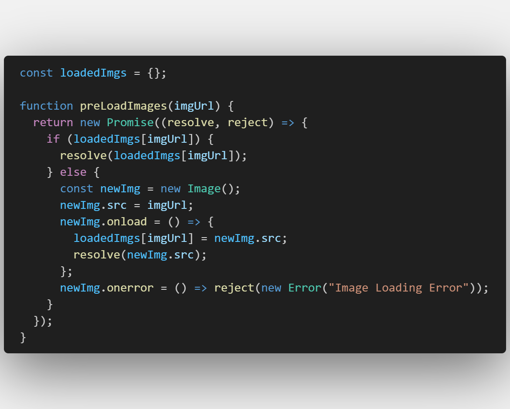

# Creative Agency Template

The **Creative Agency Template** is a modern, responsive website design crafted for creative agencies looking to showcase their services and portfolio. This template features a clean layout, vibrant color options, and intuitive navigation, making it easy for users to explore your offerings. With sections for an introduction, about us, skills, and customizable settings.

## Technologies Used

- HTML5
- CSS3
- JavaScript

## Features

1. **Responsive Design:** The website is designed to be responsive, adapting to various screen sizes.
2. **Dynamic Dropdown Menu:** Responsive dropdown menu that enhances navigation on small screens.
3. **Dynamic Image Rotation:** A dynamic background image rotation that changes every 10 seconds.
4. **Preloaded Background Images:** Ensures seamless transition by preloading images.
   
5. **Animated Skill Progress Bars:** Each skill in the skills section is represented with progress bar
   that animates to reflect proficiency when scrolled into view. The progress percentage is dynamically held
   in **css variable**, which takes its value from a **custom data attribute** in the HTML.
6. **Throttled Scroll Events:** Optimized scroll event handling for smooth animations and performance.
7. **User Setting Management:** Users can customize their experience by selecting their preferences,including
   **main color**, **automatic background rotation**. All settings are saved in local storage for persistence.

## License

This project is licensed under the MIT License. see the [LICENSE](./LICENSE) file for details
